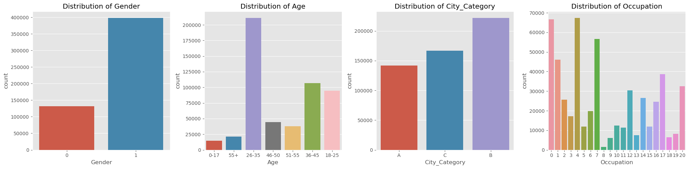
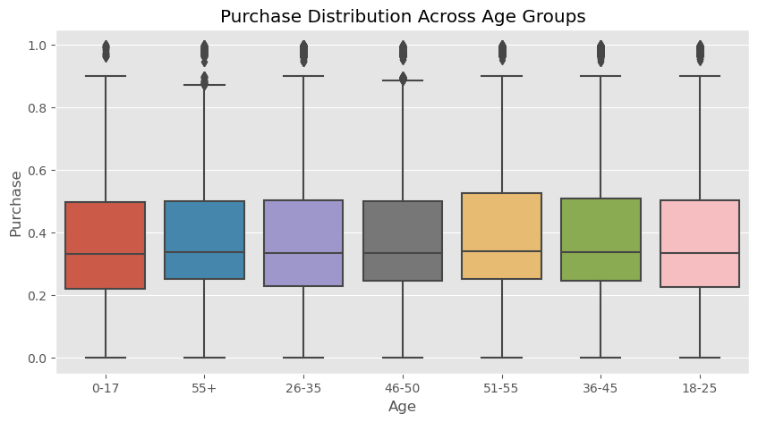
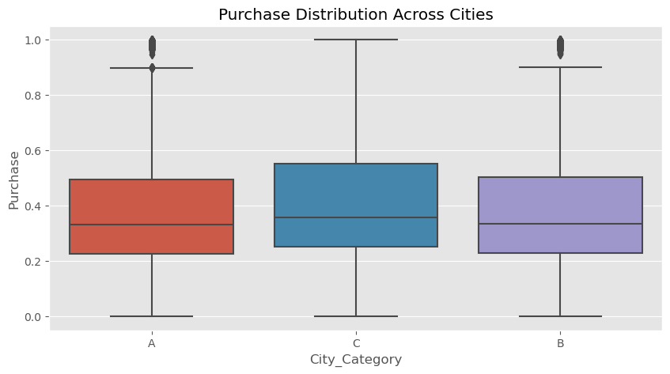
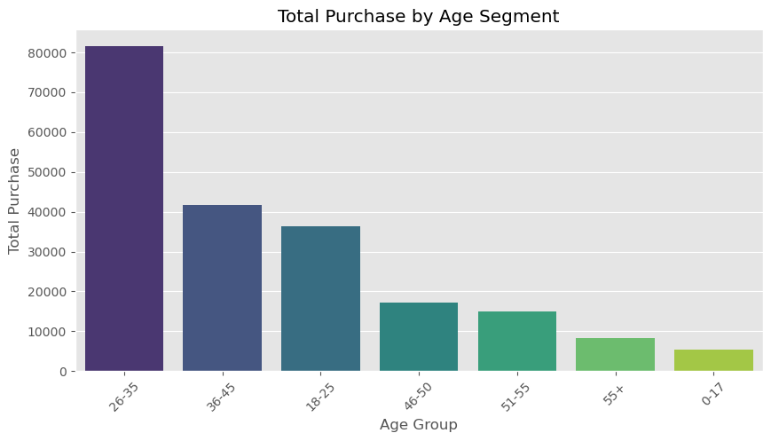
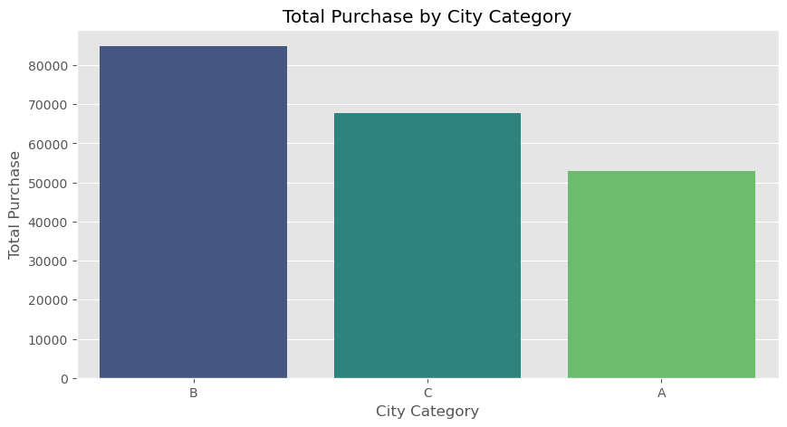
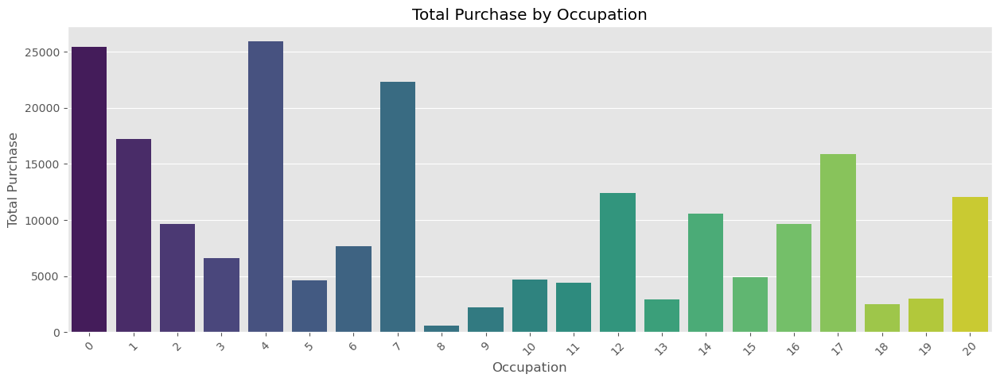
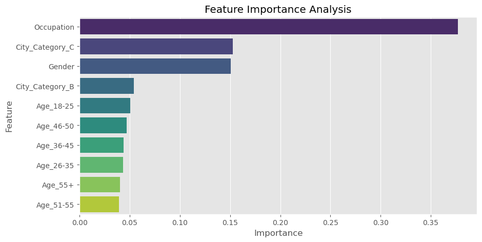

```python
# STEP 1: Importing Libraries
# Import necessary libraries for data importation, cleaning, and visualization
import pandas as pd
import numpy as np
import matplotlib.pyplot as plt
import seaborn as sns

# Load the dataset
data = pd.read_csv('merged_dataset.csv')

# Display the first few rows to understand the structure of the dataset
data.head()
```


<div>
<style scoped>
    .dataframe tbody tr th:only-of-type {
        vertical-align: middle;
    }

    .dataframe tbody tr th {
        vertical-align: top;
    }

    .dataframe thead th {
        text-align: right;
    }
</style>
<table border="1" class="dataframe">
  <thead>
    <tr style="text-align: right;">
      <th></th>
      <th>Gender</th>
      <th>Age</th>
      <th>Occupation</th>
      <th>City_Category</th>
      <th>Stay_In_Current_City_Years</th>
      <th>Marital_Status</th>
      <th>Product_Category</th>
      <th>Purchase</th>
      <th>Store</th>
      <th>Weekly_Sales</th>
      <th>Holiday_Flag</th>
      <th>Temperature</th>
      <th>Fuel_Price</th>
      <th>CPI</th>
      <th>Unemployment</th>
      <th>Year</th>
      <th>Month</th>
    </tr>
  </thead>
  <tbody>
    <tr>
      <th>0</th>
      <td>0</td>
      <td>0-17</td>
      <td>10</td>
      <td>A</td>
      <td>2</td>
      <td>0</td>
      <td>3</td>
      <td>0.348992</td>
      <td>1.0</td>
      <td>0.397291</td>
      <td>0.0</td>
      <td>0.434149</td>
      <td>0.050100</td>
      <td>0.840500</td>
      <td>0.405118</td>
      <td>2010.0</td>
      <td>2.0</td>
    </tr>
    <tr>
      <th>1</th>
      <td>0</td>
      <td>0-17</td>
      <td>10</td>
      <td>A</td>
      <td>2</td>
      <td>0</td>
      <td>1</td>
      <td>0.634181</td>
      <td>1.0</td>
      <td>0.396811</td>
      <td>1.0</td>
      <td>0.396967</td>
      <td>0.038076</td>
      <td>0.841941</td>
      <td>0.405118</td>
      <td>2010.0</td>
      <td>2.0</td>
    </tr>
    <tr>
      <th>2</th>
      <td>0</td>
      <td>0-17</td>
      <td>10</td>
      <td>A</td>
      <td>2</td>
      <td>0</td>
      <td>12</td>
      <td>0.058875</td>
      <td>1.0</td>
      <td>0.388501</td>
      <td>0.0</td>
      <td>0.410861</td>
      <td>0.021042</td>
      <td>0.842405</td>
      <td>0.405118</td>
      <td>2010.0</td>
      <td>2.0</td>
    </tr>
    <tr>
      <th>3</th>
      <td>0</td>
      <td>0-17</td>
      <td>10</td>
      <td>A</td>
      <td>2</td>
      <td>0</td>
      <td>12</td>
      <td>0.043634</td>
      <td>1.0</td>
      <td>0.332458</td>
      <td>0.0</td>
      <td>0.476419</td>
      <td>0.044589</td>
      <td>0.842707</td>
      <td>0.405118</td>
      <td>2010.0</td>
      <td>2.0</td>
    </tr>
    <tr>
      <th>4</th>
      <td>1</td>
      <td>55+</td>
      <td>16</td>
      <td>C</td>
      <td>4</td>
      <td>0</td>
      <td>8</td>
      <td>0.332248</td>
      <td>1.0</td>
      <td>0.372661</td>
      <td>0.0</td>
      <td>0.475147</td>
      <td>0.076653</td>
      <td>0.843008</td>
      <td>0.405118</td>
      <td>2010.0</td>
      <td>3.0</td>
    </tr>
  </tbody>
</table>
</div>


```python
# STEP 2: Understanding the Data
# Check the shape of the dataset (number of rows and columns)
data.shape
```


    (550068, 17)


```python
# Display column names to understand available features
data.columns
```


    Index(['Gender', 'Age', 'Occupation', 'City_Category',
           'Stay_In_Current_City_Years', 'Marital_Status', 'Product_Category',
           'Purchase', 'Store', 'Weekly_Sales', 'Holiday_Flag', 'Temperature',
           'Fuel_Price', 'CPI', 'Unemployment', 'Year', 'Month'],
          dtype='object')


```python
# Generate a statistical summary of numerical features
data.describe()
```


<div>
<style scoped>
    .dataframe tbody tr th:only-of-type {
        vertical-align: middle;
    }

    .dataframe tbody tr th {
        vertical-align: top;
    }

    .dataframe thead th {
        text-align: right;
    }
</style>
<table border="1" class="dataframe">
  <thead>
    <tr style="text-align: right;">
      <th></th>
      <th>Gender</th>
      <th>Occupation</th>
      <th>Stay_In_Current_City_Years</th>
      <th>Marital_Status</th>
      <th>Product_Category</th>
      <th>Purchase</th>
      <th>Store</th>
      <th>Weekly_Sales</th>
      <th>Holiday_Flag</th>
      <th>Temperature</th>
      <th>Fuel_Price</th>
      <th>CPI</th>
      <th>Unemployment</th>
      <th>Year</th>
      <th>Month</th>
    </tr>
  </thead>
  <tbody>
    <tr>
      <th>count</th>
      <td>550068.000000</td>
      <td>550068.000000</td>
      <td>550068.000000</td>
      <td>550068.000000</td>
      <td>550068.000000</td>
      <td>550068.000000</td>
      <td>6435.000000</td>
      <td>6435.000000</td>
      <td>6435.000000</td>
      <td>6435.000000</td>
      <td>6435.000000</td>
      <td>6435.000000</td>
      <td>6435.000000</td>
      <td>6435.000000</td>
      <td>6435.000000</td>
    </tr>
    <tr>
      <th>mean</th>
      <td>0.753105</td>
      <td>8.076707</td>
      <td>1.858418</td>
      <td>0.409653</td>
      <td>5.404270</td>
      <td>0.386320</td>
      <td>23.000000</td>
      <td>0.231934</td>
      <td>0.069930</td>
      <td>0.613736</td>
      <td>0.444192</td>
      <td>0.449886</td>
      <td>0.394877</td>
      <td>2010.965035</td>
      <td>6.447552</td>
    </tr>
    <tr>
      <th>std</th>
      <td>0.431205</td>
      <td>6.522660</td>
      <td>1.289443</td>
      <td>0.491770</td>
      <td>3.936211</td>
      <td>0.209740</td>
      <td>12.988182</td>
      <td>0.156391</td>
      <td>0.255049</td>
      <td>0.180479</td>
      <td>0.229970</td>
      <td>0.389020</td>
      <td>0.179786</td>
      <td>0.797019</td>
      <td>3.238308</td>
    </tr>
    <tr>
      <th>min</th>
      <td>0.000000</td>
      <td>0.000000</td>
      <td>0.000000</td>
      <td>0.000000</td>
      <td>1.000000</td>
      <td>0.000000</td>
      <td>1.000000</td>
      <td>0.000000</td>
      <td>0.000000</td>
      <td>0.000000</td>
      <td>0.000000</td>
      <td>0.000000</td>
      <td>0.000000</td>
      <td>2010.000000</td>
      <td>1.000000</td>
    </tr>
    <tr>
      <th>25%</th>
      <td>1.000000</td>
      <td>2.000000</td>
      <td>1.000000</td>
      <td>0.000000</td>
      <td>1.000000</td>
      <td>0.242641</td>
      <td>12.000000</td>
      <td>0.095149</td>
      <td>0.000000</td>
      <td>0.484540</td>
      <td>0.230962</td>
      <td>0.056055</td>
      <td>0.288672</td>
      <td>2010.000000</td>
      <td>4.000000</td>
    </tr>
    <tr>
      <th>50%</th>
      <td>1.000000</td>
      <td>7.000000</td>
      <td>2.000000</td>
      <td>0.000000</td>
      <td>5.000000</td>
      <td>0.335505</td>
      <td>23.000000</td>
      <td>0.208042</td>
      <td>0.000000</td>
      <td>0.633366</td>
      <td>0.487475</td>
      <td>0.558992</td>
      <td>0.382883</td>
      <td>2011.000000</td>
      <td>6.000000</td>
    </tr>
    <tr>
      <th>75%</th>
      <td>1.000000</td>
      <td>14.000000</td>
      <td>3.000000</td>
      <td>1.000000</td>
      <td>8.000000</td>
      <td>0.502818</td>
      <td>34.000000</td>
      <td>0.335349</td>
      <td>0.000000</td>
      <td>0.753425</td>
      <td>0.632766</td>
      <td>0.856779</td>
      <td>0.454572</td>
      <td>2012.000000</td>
      <td>9.000000</td>
    </tr>
    <tr>
      <th>max</th>
      <td>1.000000</td>
      <td>20.000000</td>
      <td>4.000000</td>
      <td>1.000000</td>
      <td>20.000000</td>
      <td>1.000000</td>
      <td>45.000000</td>
      <td>1.000000</td>
      <td>1.000000</td>
      <td>1.000000</td>
      <td>1.000000</td>
      <td>1.000000</td>
      <td>1.000000</td>
      <td>2012.000000</td>
      <td>12.000000</td>
    </tr>
  </tbody>
</table>
</div>


```python
# Check for missing values in the dataset
data.isnull().sum()
```


    Gender                             0
    Age                                0
    Occupation                         0
    City_Category                      0
    Stay_In_Current_City_Years         0
    Marital_Status                     0
    Product_Category                   0
    Purchase                           0
    Store                         543633
    Weekly_Sales                  543633
    Holiday_Flag                  543633
    Temperature                   543633
    Fuel_Price                    543633
    CPI                           543633
    Unemployment                  543633
    Year                          543633
    Month                         543633
    dtype: int64


```python
# Display data types of each column
data.info()
```

    <class 'pandas.core.frame.DataFrame'>
    RangeIndex: 550068 entries, 0 to 550067
    Data columns (total 17 columns):
     #   Column                      Non-Null Count   Dtype  
    ---  ------                      --------------   -----  
     0   Gender                      550068 non-null  int64  
     1   Age                         550068 non-null  object 
     2   Occupation                  550068 non-null  int64  
     3   City_Category               550068 non-null  object 
     4   Stay_In_Current_City_Years  550068 non-null  int64  
     5   Marital_Status              550068 non-null  int64  
     6   Product_Category            550068 non-null  int64  
     7   Purchase                    550068 non-null  float64
     8   Store                       6435 non-null    float64
     9   Weekly_Sales                6435 non-null    float64
     10  Holiday_Flag                6435 non-null    float64
     11  Temperature                 6435 non-null    float64
     12  Fuel_Price                  6435 non-null    float64
     13  CPI                         6435 non-null    float64
     14  Unemployment                6435 non-null    float64
     15  Year                        6435 non-null    float64
     16  Month                       6435 non-null    float64
    dtypes: float64(10), int64(5), object(2)
    memory usage: 71.3+ MB


```python
# STEP 3: Data Cleaning
# At this stage, we will clean and prepare the data to make it ready for analysis.

# Remove any duplicate rows from the dataset, if present
data = data.drop_duplicates()
```


```python
# Check for and handle missing values. For simplicity, fill missing numerical values with the median
# and categorical values with the mode.
def fill_missing(col):
    if col.dtypes != 'O':
        return col.fillna(col.median())
    else:
        return col.fillna(col.mode()[0])

data = data.apply(fill_missing, axis=0)
```


```python
# Verify that there are no more missing values
data.isnull().sum()
```


    Gender                        0
    Age                           0
    Occupation                    0
    City_Category                 0
    Stay_In_Current_City_Years    0
    Marital_Status                0
    Product_Category              0
    Purchase                      0
    Store                         0
    Weekly_Sales                  0
    Holiday_Flag                  0
    Temperature                   0
    Fuel_Price                    0
    CPI                           0
    Unemployment                  0
    Year                          0
    Month                         0
    dtype: int64


```python
# Confirm data cleaning by reviewing the dataset's structure again
data.info()
```

    <class 'pandas.core.frame.DataFrame'>
    Index: 529878 entries, 0 to 550067
    Data columns (total 17 columns):
     #   Column                      Non-Null Count   Dtype  
    ---  ------                      --------------   -----  
     0   Gender                      529878 non-null  int64  
     1   Age                         529878 non-null  object 
     2   Occupation                  529878 non-null  int64  
     3   City_Category               529878 non-null  object 
     4   Stay_In_Current_City_Years  529878 non-null  int64  
     5   Marital_Status              529878 non-null  int64  
     6   Product_Category            529878 non-null  int64  
     7   Purchase                    529878 non-null  float64
     8   Store                       529878 non-null  float64
     9   Weekly_Sales                529878 non-null  float64
     10  Holiday_Flag                529878 non-null  float64
     11  Temperature                 529878 non-null  float64
     12  Fuel_Price                  529878 non-null  float64
     13  CPI                         529878 non-null  float64
     14  Unemployment                529878 non-null  float64
     15  Year                        529878 non-null  float64
     16  Month                       529878 non-null  float64
    dtypes: float64(10), int64(5), object(2)
    memory usage: 72.8+ MB


```python
# STEP 4: Data Exploration (Visualization)
# Let's add some styling for better visualization
plt.style.use('ggplot')
```


```python
# Explore the customer demographics to understand patterns
# We'll focus on key columns that may influence profitability
columns_to_visualize = ['Gender', 'Age', 'City_Category', 'Occupation']

plt.figure(figsize=(20, 5))
for i, column in enumerate(columns_to_visualize):
    plt.subplot(1, len(columns_to_visualize), i + 1)
    sns.countplot(x=column, data=data)
    plt.title(f"Distribution of {column}")
plt.tight_layout()
plt.show()
```


    

    


```python
plt.figure(figsize=(10, 5))
sns.boxplot(x='Age', y='Purchase', data=data)
plt.title('Purchase Distribution Across Age Groups')
plt.show()
```


    

    


```python
# Explanation of Age vs Purchase visualization:
"""
This boxplot shows how purchase behavior varies across different age groups:

- The median purchase amount is relatively consistent across most age groups, but there are slight variations.
- Younger customers (18-25 and 26-35) appear to have slightly higher purchase ranges compared to older groups.
- There are more outliers in younger age groups, indicating a few high-value purchases in these segments.
- This suggests that age groups like 18-25 and 26-35 could be targeted for high-value products or campaigns.
"""
```


    '\nThis boxplot shows how purchase behavior varies across different age groups:\n\n- The median purchase amount is relatively consistent across most age groups, but there are slight variations.\n- Younger customers (18-25 and 26-35) appear to have slightly higher purchase ranges compared to older groups.\n- There are more outliers in younger age groups, indicating a few high-value purchases in these segments.\n- This suggests that age groups like 18-25 and 26-35 could be targeted for high-value products or campaigns.\n'


```python
# Let's analyze the relationship between Purchase and demographics
# For example, let's see how Purchase varies by City_Category and Age
plt.figure(figsize=(10, 5))
sns.boxplot(x='City_Category', y='Purchase', data=data)
plt.title('Purchase Distribution Across Cities')
plt.show()
```


    

    


```python
# Explanation of Purchase Distribution Across Cities visualization:
"""
This boxplot shows how purchase behavior varies across different city categories:

- **City Category A**:
  - Customers in Category A have a lower median purchase value compared to other categories.
  - The range of purchases is narrower, with fewer high-value outliers.

- **City Category B**:
  - Category B shows the highest median purchase value.
  - There is a wider range of purchases, including several high-value outliers, indicating some very profitable customers.
  - This makes Category B a key focus for targeting high-value segments.

- **City Category C**:
  - While the median purchase value is similar to Category A, Category C has a slightly broader purchase range.
  - A few high-value outliers suggest potential opportunities, though less prominent than Category B.

**Insights**:
- City Category B stands out as having the most profitable customers, both in terms of median purchases and high-value outliers.
- Categories A and C show lower overall purchase values, but Category C may have a slightly higher potential than A due to its broader range and outliers.
"""

```


    '\nThis boxplot shows how purchase behavior varies across different city categories:\n\n- **City Category A**:\n  - Customers in Category A have a lower median purchase value compared to other categories.\n  - The range of purchases is narrower, with fewer high-value outliers.\n\n- **City Category B**:\n  - Category B shows the highest median purchase value.\n  - There is a wider range of purchases, including several high-value outliers, indicating some very profitable customers.\n  - This makes Category B a key focus for targeting high-value segments.\n\n- **City Category C**:\n  - While the median purchase value is similar to Category A, Category C has a slightly broader purchase range.\n  - A few high-value outliers suggest potential opportunities, though less prominent than Category B.\n\n**Insights**:\n- City Category B stands out as having the most profitable customers, both in terms of median purchases and high-value outliers.\n- Categories A and C show lower overall purchase values, but Category C may have a slightly higher potential than A due to its broader range and outliers.\n'


```python
# STEP 5: Segmenting Customers Based on Profitability
# To identify the most profitable customer segments, let's group data by key demographics
# and calculate the total and average purchase amounts.

# Group by Age
age_segment = data.groupby('Age')['Purchase'].agg(['sum', 'mean', 'count']).reset_index()
age_segment = age_segment.sort_values(by='sum', ascending=False)
print("Age Segment Analysis:")
print(age_segment)
```

    Age Segment Analysis:
         Age           sum      mean   count
    2  26-35  81633.391916  0.387200  210830
    3  36-45  41651.268779  0.390622  106628
    1  18-25  36291.108230  0.383826   94551
    4  46-50  17179.746503  0.385274   44591
    5  51-55  14982.954695  0.398610   37588
    6    55+   8218.384191  0.390348   21054
    0   0-17   5465.430122  0.373424   14636


```python
# Group by City_Category
city_segment = data.groupby('City_Category')['Purchase'].agg(['sum', 'mean', 'count']).reset_index()
city_segment = city_segment.sort_values(by='sum', ascending=False)
print("\nCity Category Analysis:")
print(city_segment)

```

    
    City Category Analysis:
      City_Category           sum      mean   count
    1             B  84864.732932  0.383060  221544
    2             C  67662.446073  0.405881  166705
    0             A  52895.105432  0.373477  141629


```python
# Group by Occupation
occupation_segment = data.groupby('Occupation')['Purchase'].agg(['sum', 'mean', 'count']).reset_index()
occupation_segment = occupation_segment.sort_values(by='sum', ascending=False)
print("\nOccupation Segment Analysis:")
print(occupation_segment)
```

    
    Occupation Segment Analysis:
        Occupation           sum      mean  count
    4            4  25970.108439  0.385777  67319
    0            0  25467.652094  0.382122  66648
    7            7  22347.281849  0.394717  56616
    1            1  17260.236336  0.374742  46059
    17          17  15897.468746  0.410649  38713
    12          12  12413.573719  0.409527  30312
    20          20  12041.945384  0.370316  32518
    14          14  10570.928807  0.397329  26605
    16          16   9686.281181  0.392714  24665
    2            2   9640.929600  0.374798  25723
    6            6   7659.317884  0.387598  19761
    3            3   6631.773936  0.384072  17267
    15          15   4879.878575  0.408529  11945
    10          10   4686.941208  0.374656  12510
    5            5   4638.022798  0.389619  11904
    11          11   4381.678567  0.385338  11371
    19          19   3000.330661  0.363985   8243
    13          13   2924.395048  0.389038   7517
    18          18   2494.959414  0.383133   6512
    9            9   2221.444403  0.361563   6144
    8            8    607.135789  0.397861   1526


```python
# STEP 6: Visualizing Profitability by Segment
# Visualize total purchase amounts for each segment

# Age Segment Visualization
plt.figure(figsize=(10, 5))
sns.barplot(x='Age', y='sum', data=age_segment, palette='viridis')
plt.title('Total Purchase by Age Segment')
plt.xlabel('Age Group')
plt.ylabel('Total Purchase')
plt.xticks(rotation=45)
plt.show()
```


    

    


```python
# Explanation of Age Segment Visualization:
"""
This bar chart displays the total purchase contributions across different age groups:
- Customers aged 26-35 contribute the highest total purchases, making them a critical target group.
- Other age groups, like 36-45 and 18-25, also show substantial contributions but at a lower level.
- Age groups like 0-17 and 55+ show significantly lower purchase totals, suggesting less engagement or spending capacity.
This insight allows businesses to target their marketing and product strategies towards the 18-45 age group.
"""
```


    '\nThis bar chart displays the total purchase contributions across different age groups:\n- Customers aged 26-35 contribute the highest total purchases, making them a critical target group.\n- Other age groups, like 36-45 and 18-25, also show substantial contributions but at a lower level.\n- Age groups like 0-17 and 55+ show significantly lower purchase totals, suggesting less engagement or spending capacity.\nThis insight allows businesses to target their marketing and product strategies towards the 18-45 age group.\n'


```python
# City Category Visualization
plt.figure(figsize=(10, 5))
sns.barplot(x='City_Category', y='sum', data=city_segment, palette='viridis')
plt.title('Total Purchase by City Category')
plt.xlabel('City Category')
plt.ylabel('Total Purchase')
plt.show()
```


    

    


```python
# Explanation of City Category Visualization:
"""
This bar chart illustrates total purchase contributions across different city categories:
- Category B is the most profitable, with the highest total purchase amount.
- Category C follows, with Category A contributing the least.
- This indicates that focusing campaigns and resources on customers in Category B might yield the highest ROI.
"""
```


    '\nThis bar chart illustrates total purchase contributions across different city categories:\n- Category B is the most profitable, with the highest total purchase amount.\n- Category C follows, with Category A contributing the least.\n- This indicates that focusing campaigns and resources on customers in Category B might yield the highest ROI.\n'


```python
# Occupation Segment Visualization
plt.figure(figsize=(15, 5))
sns.barplot(x='Occupation', y='sum', data=occupation_segment, palette='viridis')
plt.title('Total Purchase by Occupation')
plt.xlabel('Occupation')
plt.ylabel('Total Purchase')
plt.xticks(rotation=45)
plt.show()
```


    

    


```python
# Explanation of Occupation Segment Visualization:
"""
This bar chart highlights the total purchase contributions from different occupations:
- Certain occupations (e.g., Occupation 0, 4, and 7) stand out as the most profitable groups.
- Other occupations show lower contributions, suggesting limited purchasing behavior in those segments.
- These insights help tailor marketing efforts to professional groups that demonstrate higher revenue potential.
"""
```


    '\nThis bar chart highlights the total purchase contributions from different occupations:\n- Certain occupations (e.g., Occupation 0, 4, and 7) stand out as the most profitable groups.\n- Other occupations show lower contributions, suggesting limited purchasing behavior in those segments.\n- These insights help tailor marketing efforts to professional groups that demonstrate higher revenue potential.\n'


```python
# STEP 7: Advanced Predictive Modeling
# Let's build a predictive model to identify potential high-value customers
from sklearn.model_selection import train_test_split
from sklearn.ensemble import RandomForestRegressor
from sklearn.metrics import mean_squared_error, r2_score
from sklearn.model_selection import train_test_split, GridSearchCV
```


```python
# Feature Selection
# Select relevant features for modeling
features = ['Gender', 'Age', 'City_Category', 'Occupation']
X = pd.get_dummies(data[features], drop_first=True)
y = data['Purchase']
```


```python
# Split the dataset into training and testing sets
X_train, X_test, y_train, y_test = train_test_split(X, y, test_size=0.3, random_state=42)
```


```python
# Build a Random Forest Regressor model
rf_model = RandomForestRegressor(random_state=42)
rf_model.fit(X_train, y_train)
```


<style>#sk-container-id-2 {
  /* Definition of color scheme common for light and dark mode */
  --sklearn-color-text: black;
  --sklearn-color-line: gray;
  /* Definition of color scheme for unfitted estimators */
  --sklearn-color-unfitted-level-0: #fff5e6;
  --sklearn-color-unfitted-level-1: #f6e4d2;
  --sklearn-color-unfitted-level-2: #ffe0b3;
  --sklearn-color-unfitted-level-3: chocolate;
  /* Definition of color scheme for fitted estimators */
  --sklearn-color-fitted-level-0: #f0f8ff;
  --sklearn-color-fitted-level-1: #d4ebff;
  --sklearn-color-fitted-level-2: #b3dbfd;
  --sklearn-color-fitted-level-3: cornflowerblue;

  /* Specific color for light theme */
  --sklearn-color-text-on-default-background: var(--sg-text-color, var(--theme-code-foreground, var(--jp-content-font-color1, black)));
  --sklearn-color-background: var(--sg-background-color, var(--theme-background, var(--jp-layout-color0, white)));
  --sklearn-color-border-box: var(--sg-text-color, var(--theme-code-foreground, var(--jp-content-font-color1, black)));
  --sklearn-color-icon: #696969;

  @media (prefers-color-scheme: dark) {
    /* Redefinition of color scheme for dark theme */
    --sklearn-color-text-on-default-background: var(--sg-text-color, var(--theme-code-foreground, var(--jp-content-font-color1, white)));
    --sklearn-color-background: var(--sg-background-color, var(--theme-background, var(--jp-layout-color0, #111)));
    --sklearn-color-border-box: var(--sg-text-color, var(--theme-code-foreground, var(--jp-content-font-color1, white)));
    --sklearn-color-icon: #878787;
  }
}

#sk-container-id-2 {
  color: var(--sklearn-color-text);
}

#sk-container-id-2 pre {
  padding: 0;
}

#sk-container-id-2 input.sk-hidden--visually {
  border: 0;
  clip: rect(1px 1px 1px 1px);
  clip: rect(1px, 1px, 1px, 1px);
  height: 1px;
  margin: -1px;
  overflow: hidden;
  padding: 0;
  position: absolute;
  width: 1px;
}

#sk-container-id-2 div.sk-dashed-wrapped {
  border: 1px dashed var(--sklearn-color-line);
  margin: 0 0.4em 0.5em 0.4em;
  box-sizing: border-box;
  padding-bottom: 0.4em;
  background-color: var(--sklearn-color-background);
}

#sk-container-id-2 div.sk-container {
  /* jupyter's `normalize.less` sets `[hidden] { display: none; }`
     but bootstrap.min.css set `[hidden] { display: none !important; }`
     so we also need the `!important` here to be able to override the
     default hidden behavior on the sphinx rendered scikit-learn.org.
     See: https://github.com/scikit-learn/scikit-learn/issues/21755 */
  display: inline-block !important;
  position: relative;
}

#sk-container-id-2 div.sk-text-repr-fallback {
  display: none;
}

div.sk-parallel-item,
div.sk-serial,
div.sk-item {
  /* draw centered vertical line to link estimators */
  background-image: linear-gradient(var(--sklearn-color-text-on-default-background), var(--sklearn-color-text-on-default-background));
  background-size: 2px 100%;
  background-repeat: no-repeat;
  background-position: center center;
}

/* Parallel-specific style estimator block */

#sk-container-id-2 div.sk-parallel-item::after {
  content: "";
  width: 100%;
  border-bottom: 2px solid var(--sklearn-color-text-on-default-background);
  flex-grow: 1;
}

#sk-container-id-2 div.sk-parallel {
  display: flex;
  align-items: stretch;
  justify-content: center;
  background-color: var(--sklearn-color-background);
  position: relative;
}

#sk-container-id-2 div.sk-parallel-item {
  display: flex;
  flex-direction: column;
}

#sk-container-id-2 div.sk-parallel-item:first-child::after {
  align-self: flex-end;
  width: 50%;
}

#sk-container-id-2 div.sk-parallel-item:last-child::after {
  align-self: flex-start;
  width: 50%;
}

#sk-container-id-2 div.sk-parallel-item:only-child::after {
  width: 0;
}

/* Serial-specific style estimator block */

#sk-container-id-2 div.sk-serial {
  display: flex;
  flex-direction: column;
  align-items: center;
  background-color: var(--sklearn-color-background);
  padding-right: 1em;
  padding-left: 1em;
}


/* Toggleable style: style used for estimator/Pipeline/ColumnTransformer box that is
clickable and can be expanded/collapsed.
- Pipeline and ColumnTransformer use this feature and define the default style
- Estimators will overwrite some part of the style using the `sk-estimator` class
*/

/* Pipeline and ColumnTransformer style (default) */

#sk-container-id-2 div.sk-toggleable {
  /* Default theme specific background. It is overwritten whether we have a
  specific estimator or a Pipeline/ColumnTransformer */
  background-color: var(--sklearn-color-background);
}

/* Toggleable label */
#sk-container-id-2 label.sk-toggleable__label {
  cursor: pointer;
  display: block;
  width: 100%;
  margin-bottom: 0;
  padding: 0.5em;
  box-sizing: border-box;
  text-align: center;
}

#sk-container-id-2 label.sk-toggleable__label-arrow:before {
  /* Arrow on the left of the label */
  content: "▸";
  float: left;
  margin-right: 0.25em;
  color: var(--sklearn-color-icon);
}

#sk-container-id-2 label.sk-toggleable__label-arrow:hover:before {
  color: var(--sklearn-color-text);
}

/* Toggleable content - dropdown */

#sk-container-id-2 div.sk-toggleable__content {
  max-height: 0;
  max-width: 0;
  overflow: hidden;
  text-align: left;
  /* unfitted */
  background-color: var(--sklearn-color-unfitted-level-0);
}

#sk-container-id-2 div.sk-toggleable__content.fitted {
  /* fitted */
  background-color: var(--sklearn-color-fitted-level-0);
}

#sk-container-id-2 div.sk-toggleable__content pre {
  margin: 0.2em;
  border-radius: 0.25em;
  color: var(--sklearn-color-text);
  /* unfitted */
  background-color: var(--sklearn-color-unfitted-level-0);
}

#sk-container-id-2 div.sk-toggleable__content.fitted pre {
  /* unfitted */
  background-color: var(--sklearn-color-fitted-level-0);
}

#sk-container-id-2 input.sk-toggleable__control:checked~div.sk-toggleable__content {
  /* Expand drop-down */
  max-height: 200px;
  max-width: 100%;
  overflow: auto;
}

#sk-container-id-2 input.sk-toggleable__control:checked~label.sk-toggleable__label-arrow:before {
  content: "▾";
}

/* Pipeline/ColumnTransformer-specific style */

#sk-container-id-2 div.sk-label input.sk-toggleable__control:checked~label.sk-toggleable__label {
  color: var(--sklearn-color-text);
  background-color: var(--sklearn-color-unfitted-level-2);
}

#sk-container-id-2 div.sk-label.fitted input.sk-toggleable__control:checked~label.sk-toggleable__label {
  background-color: var(--sklearn-color-fitted-level-2);
}

/* Estimator-specific style */

/* Colorize estimator box */
#sk-container-id-2 div.sk-estimator input.sk-toggleable__control:checked~label.sk-toggleable__label {
  /* unfitted */
  background-color: var(--sklearn-color-unfitted-level-2);
}

#sk-container-id-2 div.sk-estimator.fitted input.sk-toggleable__control:checked~label.sk-toggleable__label {
  /* fitted */
  background-color: var(--sklearn-color-fitted-level-2);
}

#sk-container-id-2 div.sk-label label.sk-toggleable__label,
#sk-container-id-2 div.sk-label label {
  /* The background is the default theme color */
  color: var(--sklearn-color-text-on-default-background);
}

/* On hover, darken the color of the background */
#sk-container-id-2 div.sk-label:hover label.sk-toggleable__label {
  color: var(--sklearn-color-text);
  background-color: var(--sklearn-color-unfitted-level-2);
}

/* Label box, darken color on hover, fitted */
#sk-container-id-2 div.sk-label.fitted:hover label.sk-toggleable__label.fitted {
  color: var(--sklearn-color-text);
  background-color: var(--sklearn-color-fitted-level-2);
}

/* Estimator label */

#sk-container-id-2 div.sk-label label {
  font-family: monospace;
  font-weight: bold;
  display: inline-block;
  line-height: 1.2em;
}

#sk-container-id-2 div.sk-label-container {
  text-align: center;
}

/* Estimator-specific */
#sk-container-id-2 div.sk-estimator {
  font-family: monospace;
  border: 1px dotted var(--sklearn-color-border-box);
  border-radius: 0.25em;
  box-sizing: border-box;
  margin-bottom: 0.5em;
  /* unfitted */
  background-color: var(--sklearn-color-unfitted-level-0);
}

#sk-container-id-2 div.sk-estimator.fitted {
  /* fitted */
  background-color: var(--sklearn-color-fitted-level-0);
}

/* on hover */
#sk-container-id-2 div.sk-estimator:hover {
  /* unfitted */
  background-color: var(--sklearn-color-unfitted-level-2);
}

#sk-container-id-2 div.sk-estimator.fitted:hover {
  /* fitted */
  background-color: var(--sklearn-color-fitted-level-2);
}

/* Specification for estimator info (e.g. "i" and "?") */

/* Common style for "i" and "?" */

.sk-estimator-doc-link,
a:link.sk-estimator-doc-link,
a:visited.sk-estimator-doc-link {
  float: right;
  font-size: smaller;
  line-height: 1em;
  font-family: monospace;
  background-color: var(--sklearn-color-background);
  border-radius: 1em;
  height: 1em;
  width: 1em;
  text-decoration: none !important;
  margin-left: 1ex;
  /* unfitted */
  border: var(--sklearn-color-unfitted-level-1) 1pt solid;
  color: var(--sklearn-color-unfitted-level-1);
}

.sk-estimator-doc-link.fitted,
a:link.sk-estimator-doc-link.fitted,
a:visited.sk-estimator-doc-link.fitted {
  /* fitted */
  border: var(--sklearn-color-fitted-level-1) 1pt solid;
  color: var(--sklearn-color-fitted-level-1);
}

/* On hover */
div.sk-estimator:hover .sk-estimator-doc-link:hover,
.sk-estimator-doc-link:hover,
div.sk-label-container:hover .sk-estimator-doc-link:hover,
.sk-estimator-doc-link:hover {
  /* unfitted */
  background-color: var(--sklearn-color-unfitted-level-3);
  color: var(--sklearn-color-background);
  text-decoration: none;
}

div.sk-estimator.fitted:hover .sk-estimator-doc-link.fitted:hover,
.sk-estimator-doc-link.fitted:hover,
div.sk-label-container:hover .sk-estimator-doc-link.fitted:hover,
.sk-estimator-doc-link.fitted:hover {
  /* fitted */
  background-color: var(--sklearn-color-fitted-level-3);
  color: var(--sklearn-color-background);
  text-decoration: none;
}

/* Span, style for the box shown on hovering the info icon */
.sk-estimator-doc-link span {
  display: none;
  z-index: 9999;
  position: relative;
  font-weight: normal;
  right: .2ex;
  padding: .5ex;
  margin: .5ex;
  width: min-content;
  min-width: 20ex;
  max-width: 50ex;
  color: var(--sklearn-color-text);
  box-shadow: 2pt 2pt 4pt #999;
  /* unfitted */
  background: var(--sklearn-color-unfitted-level-0);
  border: .5pt solid var(--sklearn-color-unfitted-level-3);
}

.sk-estimator-doc-link.fitted span {
  /* fitted */
  background: var(--sklearn-color-fitted-level-0);
  border: var(--sklearn-color-fitted-level-3);
}

.sk-estimator-doc-link:hover span {
  display: block;
}

/* "?"-specific style due to the `<a>` HTML tag */

#sk-container-id-2 a.estimator_doc_link {
  float: right;
  font-size: 1rem;
  line-height: 1em;
  font-family: monospace;
  background-color: var(--sklearn-color-background);
  border-radius: 1rem;
  height: 1rem;
  width: 1rem;
  text-decoration: none;
  /* unfitted */
  color: var(--sklearn-color-unfitted-level-1);
  border: var(--sklearn-color-unfitted-level-1) 1pt solid;
}

#sk-container-id-2 a.estimator_doc_link.fitted {
  /* fitted */
  border: var(--sklearn-color-fitted-level-1) 1pt solid;
  color: var(--sklearn-color-fitted-level-1);
}

/* On hover */
#sk-container-id-2 a.estimator_doc_link:hover {
  /* unfitted */
  background-color: var(--sklearn-color-unfitted-level-3);
  color: var(--sklearn-color-background);
  text-decoration: none;
}

#sk-container-id-2 a.estimator_doc_link.fitted:hover {
  /* fitted */
  background-color: var(--sklearn-color-fitted-level-3);
}
</style><div id="sk-container-id-2" class="sk-top-container"><div class="sk-text-repr-fallback"><pre>RandomForestRegressor(random_state=42)</pre><b>In a Jupyter environment, please rerun this cell to show the HTML representation or trust the notebook. <br />On GitHub, the HTML representation is unable to render, please try loading this page with nbviewer.org.</b></div><div class="sk-container" hidden><div class="sk-item"><div class="sk-estimator fitted sk-toggleable"><input class="sk-toggleable__control sk-hidden--visually" id="sk-estimator-id-2" type="checkbox" checked><label for="sk-estimator-id-2" class="sk-toggleable__label fitted sk-toggleable__label-arrow fitted">&nbsp;&nbsp;RandomForestRegressor<a class="sk-estimator-doc-link fitted" rel="noreferrer" target="_blank" href="https://scikit-learn.org/1.5/modules/generated/sklearn.ensemble.RandomForestRegressor.html">?<span>Documentation for RandomForestRegressor</span></a><span class="sk-estimator-doc-link fitted">i<span>Fitted</span></span></label><div class="sk-toggleable__content fitted"><pre>RandomForestRegressor(random_state=42)</pre></div> </div></div></div></div>


```python
# Make predictions on the test set
y_pred = rf_model.predict(X_test)
```


```python
# Evaluate the model
mse = mean_squared_error(y_test, y_pred)
r2 = r2_score(y_test, y_pred)

print("Mean Squared Error:", mse)
print("R-squared Score:", r2)
```

    Mean Squared Error: 0.043850451367509695
    R-squared Score: 0.01761853591134177


```python
# Model Evaluation Explanation:

"""
1. **Mean Squared Error (MSE)**:
   - The MSE value is 0.04385, which represents the average squared difference between the predicted and actual values.
   - A lower MSE is better because it indicates that the model's predictions are closer to the actual values.
   - In this case, the MSE is relatively low, suggesting that the model's predictions are somewhat close to the actual purchase values.

2. **R-squared Score**:
   - The R-squared value is 0.0176, which indicates how well the model explains the variance in the target variable (purchases).
   - An R-squared close to 0 means the model doesn't explain much of the variation in the data.
   - Here, the low R-squared value suggests that the model is not capturing a strong relationship between the features and the target (Purchase).

**Insights**:
- While the MSE indicates decent accuracy in the predictions, the low R-squared value suggests the model is not robust and may not generalize well.
- To improve the model, consider adding more relevant features, refining the existing features, or trying other algorithms that might better capture the relationships in the data.
"""
```


    "\n1. **Mean Squared Error (MSE)**:\n   - The MSE value is 0.04385, which represents the average squared difference between the predicted and actual values.\n   - A lower MSE is better because it indicates that the model's predictions are closer to the actual values.\n   - In this case, the MSE is relatively low, suggesting that the model's predictions are somewhat close to the actual purchase values.\n\n2. **R-squared Score**:\n   - The R-squared value is 0.0176, which indicates how well the model explains the variance in the target variable (purchases).\n   - An R-squared close to 0 means the model doesn't explain much of the variation in the data.\n   - Here, the low R-squared value suggests that the model is not capturing a strong relationship between the features and the target (Purchase).\n\n**Insights**:\n- While the MSE indicates decent accuracy in the predictions, the low R-squared value suggests the model is not robust and may not generalize well.\n- To improve the model, consider adding more relevant features, refining the existing features, or trying other algorithms that might better capture the relationships in the data.\n"


```python
# Feature Importance Analysis
importances = rf_model.feature_importances_
feature_importance_df = pd.DataFrame({
    'Feature': X.columns,
    'Importance': importances
}).sort_values(by='Importance', ascending=False)

print("\nFeature Importance:")
print(feature_importance_df)
```

    
    Feature Importance:
               Feature  Importance
    1       Occupation    0.377172
    9  City_Category_C    0.152867
    0           Gender    0.150809
    8  City_Category_B    0.054130
    2        Age_18-25    0.050673
    5        Age_46-50    0.047141
    4        Age_36-45    0.044036
    3        Age_26-35    0.043502
    7          Age_55+    0.040193
    6        Age_51-55    0.039476


```python
### Interpretation of the Results:
1. **Occupation (0.377172)**:
   - This is the most important feature in the model.
   - It contributes the most to explaining the variations in purchase behavior.
   - This suggests that understanding customers' occupations can significantly help in predicting their purchase patterns.

2. **City_Category_C (0.152867)** and **City_Category_B (0.054130)**:
   - These city categories are the second and fourth most important features.
   - This highlights that where a customer lives (urban, semi-urban, rural) plays a significant role in their purchasing behavior.

3. **Gender (0.150809)**:
   - Gender is the third most influential feature, indicating differences in purchasing patterns based on gender.

4. **Age Groups**:
   - Age groups contribute moderately to the predictions, with **Age 18-25 (0.050673)** being the most important among them.
   - This implies that younger customers' purchasing behaviors are slightly more predictable compared to other age groups.

5. **Less Important Features**:
   - Features like **Age 55+ (0.040193)** and **Age 51-55 (0.039476)** are the least important.
   - These groups may have less consistent purchasing behavior or may contribute less to variations in the target variable.

### Insights:
- Occupation, city category, and gender are the top factors influencing purchasing behavior. 
- Marketing strategies can focus on occupations and city categories while tailoring approaches to different genders and age groups.
- Less important features, such as certain age groups, might not significantly affect the predictions, but they still contribute some value.

By understanding feature importance, businesses can prioritize these variables to make more informed decisions in their marketing and sales strategies.
"""
```


```python
# Visualize Feature Importance
plt.figure(figsize=(10, 5))
sns.barplot(x='Importance', y='Feature', data=feature_importance_df, palette='viridis')
plt.title('Feature Importance Analysis')
plt.xlabel('Importance')
plt.ylabel('Feature')
plt.show()

```


    

    

